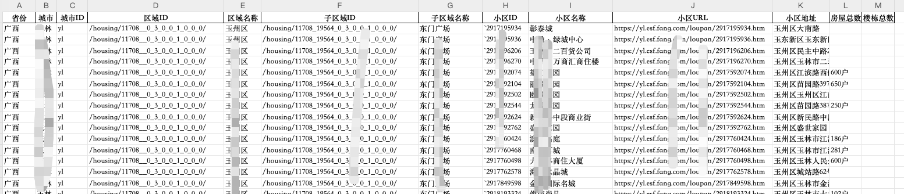

<p align="center">
    <a target="_blank" href="https://www.python.org/downloads/release/python-3810/"></a>
    <a target="_blank" href='https://github.com/fangzheng0518/fang_spider'></a>
    <a target="_blank" href="LICENSE"></a>
</p>

# 房天下小区信息爬取

[简介](#简介) | [特性](#特性) | [技术架构](#技术架构) | [快速开始](#快速开始) | [使用说明](#使用说明) | [免责声明](#免责声明) | [附录](#附录)

# 简介

一个基于进程池的房天下爬虫项目，严禁将所得数据商用，本项目只供学习使用，作者不承担任何由此带来的法律风险和损失！

# 特性

- [x] 支持Python3.6+版本
- [x] 支持数据存储sqliteDB中
- [x] 支持导出Excel
- [x] 支持自定义区域（省、市、区）采集

# 技术架构

- Python3.6+
- request
- lxml的xpath解析
- sqlite

## 实现原理

1. 打开一个需要滑块验证码的URL，手工进行滑块验证
2. 验证通过后，通过playwright保存cookie.json
3. 再次使用playwright打开chromium内核浏览器，打开别的地址，然后通过page.content()获取当前页面源码
4. 根据请求结果使用lxml解析HTML源码获取想要的字段数据

# 快速开始

1. clone本项目代码
2. 在项目根目录创建Python虚拟环境venv
    1. `cd fang_spider`
    2. `pip install virtualenv`
    3. `virtualenv venv`
3. 安装依赖库`pip install -r requirements.txt`
4. 安装playwright的chromium浏览器引擎
    1. `playwright install chromium`
5. 运行`python fang.py`
6. 根据提示输入对应信息采集

```
######################################################################################################################
                                               免责声明                                                               
此工具仅限于学习研究，用户需自己承担因使用此工具而导致的所有法律和相关责任！作者不承担任何法律责任！                 
######################################################################################################################

如果您同意本协议, 请输入Y继续: (y/n) y
功能选项：
1. 按区域采集并导出
2. 区域信息初始化
请输入功能序号: 1
请输入省份名称(必填): 广西
请输入省份下城市名称(可选): 玉林
请输入省份下城市下区域名称(可选): 
请在20s内滑动验证码......
[2023-11-14 14:39:53] 
    select
    lbp.province_name
    ,lbp.city_name
    ,lba.city_id
    ,lba.sub_region_id
    ,lba.sub_region_name
    ,t.xiaoqu_id
    ,t.xiaoqu_name
    ,t.xiaoqu_url
    from ftx_base_xiaoqu t
    inner join ftx_base_areas lba on t.city_id = lba.city_id and t.region_id=lba.region_id and t.sub_region_id=lba.sub_region_id
    inner join (select * from ftx_base_province where province_name='广西' and city_name='玉林' ) lbp on lba.city_id = lbp.city_id
    left join ftx_xiaoqu_detail lxd on t.xiaoqu_id = lxd.xiaoqu_id
    where 1=1
      and lxd.xiaoqu_id is null
    group by
    lbp.province_name
    ,lbp.city_name
    ,lba.city_id
    ,lba.sub_region_id
    ,lba.sub_region_name
    ,t.xiaoqu_id
    ,t.xiaoqu_name
    ,t.xiaoqu_url
    ;
    
开始采集[广西-玉林]区域下数据...
[2023-11-14 14:39:54] (0/14) https://yl.esf.fang.com/loupan/2918228400/housedetail.htm
[2023-11-14 14:39:55] (1/14) https://yl.esf.fang.com/loupan/2918228416/housedetail.htm
[2023-11-14 14:39:56] (2/14) https://yl.esf.fang.com/loupan/2918230480/housedetail.htm
[2023-11-14 14:39:57] (3/14) https://yl.esf.fang.com/loupan/2918235820/housedetail.htm
[2023-11-14 14:39:57] (4/14) https://yl.esf.fang.com/loupan/2918242386/housedetail.htm
[2023-11-14 14:39:59] (5/14) https://yl.esf.fang.com/loupan/2918242896/housedetail.htm
[2023-11-14 14:39:59] (6/14) https://yl.esf.fang.com/loupan/2918242898/housedetail.htm
[2023-11-14 14:40:00] (7/14) https://yl.esf.fang.com/loupan/2918243034/housedetail.htm
[2023-11-14 14:40:00] (8/14) https://yl.esf.fang.com/loupan/2918243698/housedetail.htm
[2023-11-14 14:40:01] (9/14) https://yl.esf.fang.com/loupan/2917195882/housedetail.htm
[2023-11-14 14:40:02] (10/14) https://yl.esf.fang.com/loupan/2917195890/housedetail.htm
[2023-11-14 14:40:03] (11/14) https://yl.esf.fang.com/loupan/2917195922/housedetail.htm
[2023-11-14 14:40:05] (12/14) https://yl.esf.fang.com/loupan/2917195924/housedetail.htm
[2023-11-14 14:40:05] (13/14) https://yl.esf.fang.com/loupan/2917195926/housedetail.htm
[2023-11-14 14:40:05] 导出成功:广西-玉林数据_1699944005.xlsx
程序运行完成...

Process finished with exit code 0
```

# 使用说明

## 数据存储

- 程序运行时会使用sqlite数据库存储当前job运行历史，数据库文件`fang.db`

## 采集更多信息

目前程序只测试采集每个小区的楼栋数，小区数，小区地址，可根据需要修改代码采集更多字段 可修改`get_xiaoqu_detail`函数中已获取了所有标签数据，通过get_specific_value(xiaoqu_detail, '
房屋总数')函数获取的部分标签

```python
get_specific_value(xiaoqu_detail, '房屋总数')
```

## 运行截图

- 运行截图
  
- 采集字段
  
- 运行结果
  

# 免责声明

请勿将`fang_spider`应用到任何可能会违反法律规定和道德约束的工作中，请友善使用`fang_spider`，遵守蜘蛛协议，不要将`fang_spider`用于任何非法用途。如您选择使用`fang_spider`
即代表您遵守此协议，作者不承担任何由于您违反此协议带来任何的法律风险和损失，一切后果由您承担。
